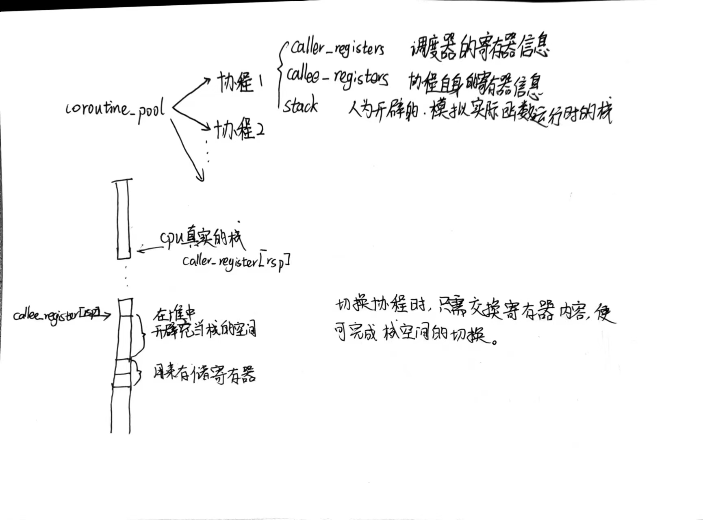

# 协程实验报告

赵泽锴 2021010731 计12

## Task 1

### 初始状态分析

```c++
uint64_t rsp = (uint64_t)&stack[stack_size - 1];
rsp = rsp - (rsp & 0xF);

void coroutine_main(struct basic_context *context);

callee_registers[(int)Registers::RSP] = rsp;
// 协程入口是 coroutine_entry
callee_registers[(int)Registers::RIP] = (uint64_t)coroutine_entry;
// 设置 r12 寄存器为 coroutine_main 的地址
callee_registers[(int)Registers::R12] = (uint64_t)coroutine_main;
// 设置 r13 寄存器，用于 coroutine_main 的参数
callee_registers[(int)Registers::R13] = (uint64_t)this;
```

为了存储函数运行时的栈帧，需要开辟空间来存储并模拟栈帧空间。`stack`即为开辟的空间。由于函数运行时的栈是从高到低，`rsp`寄存器需要在开辟的空间中的高地址，于是取数组中最后一位元素作为`rsp`的起始地址。根据规范并为了整齐，将`rsp`向下对齐到16字节边界。

`coroutine_main`即为函数的运行协程。

在每个`basic_context`都有两个寄存器数组，用来存储调度器的寄存器和函数的寄存器。在初始化时，自然是将函数的`rsp`寄存器设置为函数的栈指针所在地址，即为上面求得的`rsp`。`rip`寄存器为下一个指令的地址，由于是初始化，设置为`coroutine_entry`。将`r12`与`r13`设置为运行协程地址和参数将会在`coroutine_entry`中使用。

至此，函数栈帧与寄存器的初始化已经完成。

### 协程的运行流程

```c++
// serial_execute_all
this->context_id = 0;

int all_finished = 0;
for (int &i = g_pool->context_id; i < coroutines.size() && all_finished != coroutines.size(); i == coroutines.size() - 1 ? i = 0 : i++) {
    if (coroutines[i]->finished) continue;
    if (!coroutines[i]->ready) { // Task 2
        if (!coroutines[i]->ready_func()) continue;
        else coroutines[i]->ready = true;
    }
    coroutines[i]->resume();
    if (coroutines[i]->finished) all_finished++;
}
```

执行`serial_execute_all`时，首先从0开始问询。设置`all_finished`表示完成的函数个数，当未全部完成时持续循环问讯。到未完成协程时，执行`coroutines[i]->resume()`表示从调度器的运行环境切换到该协程的运行环境。

```c++
// resume
coroutine_switch(this->caller_registers, this->callee_registers);
```

`resume()`表示从该协程的调度器环境，即`caller_registers`切换到协程运行的环境，即`callee_registers`。接下来分析`coroutine_switch`。

```assembly
# coroutine_switch
coroutine_switch:
    # TODO: Task 1
    # 保存 callee-saved 寄存器到 %rdi 指向的上下文
    # 保存的上下文中 rip 指向 ret 指令的地址（.coroutine_ret）
    movq %rsp, 64(%rdi)
    movq %rbx, 72(%rdi)
    movq %rbp, 80(%rdi)
    movq %r12, 88(%rdi)
    movq %r13, 96(%rdi)
    movq %r14, 104(%rdi)
    movq %r15, 112(%rdi)
    leaq .coroutine_ret(%rip), %rax 
    movq %rax, 120(%rdi)  # 将返回的地址存入rip寄存器所对应的空间
    # 从 %rsi 指向的上下文恢复 callee-saved 寄存器
    # 最后 jmpq 到上下文保存的 rip
    movq 64(%rsi), %rsp
    movq 72(%rsi), %rbx
    movq 80(%rsi), %rbp
    movq 88(%rsi), %r12 
    movq 96(%rsi), %r13
    movq 104(%rsi), %r14
    movq 112(%rsi), %r15

    jmp *120(%rsi) # 跳转至切换后的返回地址，即在120(%rsi)所存储的之前的rip所存储的地址
```

首先将cpu真实的寄存器内容存储到`rdi`的空间中，对于当前情况而言，就是将`caller_registers`存上了真正的调度器的寄存器。然后将`rsi`中的内容取出，存入真正的寄存器中，并跳转到`*120(%rsi)`即`callee_registers`的`rip`中。前文已经说明，此时的`rip`为`coroutine_entry`的地址。于是执行该函数。

```assembly
coroutine_entry:
    movq %r13, %rdi
    callq *%r12
```

前文已经说明，`r13`初始化为协程的地址，`r12`初始化为`couroutine_main`的地址。该指令的作用是将该协程的指针`this`作为参数传入`coroutine_main`并执行。

```c++
void coroutine_main(struct basic_context *context) {
    context->run();
    context->finished = true;
    coroutine_switch(context->callee_registers, context->caller_registers);

    // unreachable
    assert(false);
}
```

参数`struct basic_context *context`即为初始化的`this`指针，代表着将要执行的协程。`run()`将会真正执行该协程，栈帧将会存储在`rsp`所指向的在结构体内人为开辟的`stack`，寄存器将会使用cpu真正的寄存器。若没有`yield`则函数直接完成，设置为`finished = true`，并调用`switch`从该协程的环境切换到调度器的环境。该协程执行完成，到此结束。



### 协程中途主动切出

```c++
void yield() {
    if (!g_pool->is_parallel) {
        // 从 g_pool 中获取当前协程状态
        auto context = g_pool->coroutines[g_pool->context_id];

        // 调用 coroutine_switch 切换到 coroutine_pool 上下文
        coroutine_switch(context->callee_registers, context->caller_registers);
    }
}
```

首先根据`context_id`获取当前正在运行的协程。后直接调用`coroutine_switch`从协程的运行环境切换到调度器的运行环境即可。恢复时执行`resume`切换回即可完成。

## Task 2

### 运行原理

在每个`basic_context`类中都有`ready`和`ready_func`，代表函数是否准备开始运行和更新函数运行状态的函数。初始化时将`ready`设置为`true`代表可以运行。

```c++
void sleep(uint64_t ms) {
    if (g_pool->is_parallel) {
        auto cur = get_time();
        while (
            std::chrono::duration_cast<std::chrono::milliseconds>(get_time() - cur)
            .count() < ms)
            ;
    }
    else {
        // 从 g_pool 中获取当前协程状态
        auto context = g_pool->coroutines[g_pool->context_id];

        // 获取当前时间，更新 ready_func
        // ready_func：检查当前时间，如果已经超时，则返回 true
        context->ready = false;
        auto cur = get_time();
        context->ready_func = [ms, cur]()->bool {
            if (std::chrono::duration_cast<std::chrono::milliseconds>(get_time() - cur)
                .count() < ms) return false;
            else return true;
        };

        // 调用 coroutine_switch 切换到 coroutine_pool 上下文
        coroutine_switch(context->callee_registers, context->caller_registers);
    }
}
```

协程执行`sleep`时，函数首先获取当前的协程状态，后将`ready`设置为`false`代表已经进入睡眠，不可继续执行。后更新`ready_func`。此处使用lambda表达式，捕获了睡眠开始的时间和睡眠将要持续的时间，函数将进行一次简单的判断，判断时间是否到期。后调用`coroutine_switch`从协程环境切换到调度器，重新调度。

```c++
// serial_execute_all
this->context_id = 0;

int all_finished = 0;
for (int &i = g_pool->context_id; i < coroutines.size() && all_finished != coroutines.size(); i == coroutines.size() - 1 ? i = 0 : i++) {
    if (coroutines[i]->finished) continue;
    if (!coroutines[i]->ready) { // Task 2
        if (!coroutines[i]->ready_func()) continue;
        else coroutines[i]->ready = true;
    }
    coroutines[i]->resume();
    if (coroutines[i]->finished) all_finished++;
}
```

同样调度器的轮询规则也需要更改，当函数未`ready`，需要调用更新函数检查函数是否休眠完成，如果时间已到，则更新状态。
